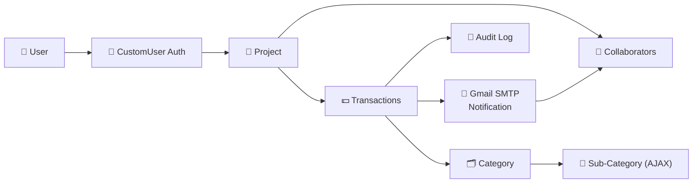

<div align="center">


<br/>

[](https://github.com/nawabsakib5/Cash-Management-Django-App/stargazers)
[](https://github.com/nawabsakib5/Cash-Management-Django-App/network/members)
[](https://github.com/nawabsakib5/Cash-Management-Django-App/commits/main)
[](#-license)

</div>

---

## 💰 About The Project

**Cash Management App** is a multi-user Django application for tracking shared finances across collaborative projects. Multiple users can join a project, log transactions under organized categories, and keep a fully auditable trail of every change — with email alerts keeping everyone in the loop. Built with a clean, **dark-themed UI** for comfortable day-to-day use.

<div align="center">

</div>

---

## 📚 Table of Contents

- [✨ Features](#-features)
- [🏗️ Architecture](#️-architecture)
- [📁 Project Structure](#-project-structure)
- [🛠️ Tech Stack](#️-tech-stack)
- [🚀 Getting Started](#-getting-started)
- [⚙️ Environment Variables](#️-environment-variables)
- [🗺️ Roadmap](#️-roadmap)
- [👤 Author](#-author)

---

## ✨ Features

<table>
<tr>
<td width="50%" valign="top">

### 👥 Multi-User Collaboration
Custom user model (`CustomUser`) with project-based access — invite users to collaborate on shared cash records.

### 📊 Per-Project Transaction Tracking
Every project keeps its own isolated ledger of income and expenses.

### 🔽 Dynamic Category Dropdowns
AJAX-powered category → sub-category selection that updates in real time as you fill a transaction form.

</td>
<td width="50%" valign="top">

### 📜 Audit Logging
Every create, update, and delete action is logged — full accountability, no silent edits.

### 📧 Email Notifications
Automatic alerts via **Gmail SMTP** when transactions or project changes happen.

### 🌙 Dark-Themed UI
A clean, modern, eye-friendly interface for daily financial tracking.

</td>
</tr>
</table>

---

## 🏗️ Architecture



---

## 📁 Project Structure

```text
Cash-Management-Django-App/
├── cashApp/              # Core app — models, views, forms, AJAX endpoints
│   ├── models.py         # CustomUser, Project, Transaction, Category, AuditLog
│   ├── views.py          # Project & transaction views
│   └── templates/        # Dark-themed UI templates
├── cashProject/          # Django project settings & root URL config
├── .gitignore
├── manage.py              # Django's command-line utility
└── requirements.txt        # Project dependencies
```

---

## 🛠️ Tech Stack

| Layer | Technology |
|---|---|
| **Backend** |   |
| **Database** |  |
| **Frontend** |    |
| **Notifications** |  |

---

## 🚀 Getting Started

### ✅ Prerequisites


### 📦 Installation

```bash
# 1. Clone the repository
git clone https://github.com/nawabsakib5/Cash-Management-Django-App.git
cd Cash-Management-Django-App

# 2. Create & activate a virtual environment
python -m venv venv
source venv/bin/activate      # Windows: venv\Scripts\activate

# 3. Install dependencies
pip install -r requirements.txt

# 4. Apply migrations
python manage.py migrate

# 5. Create a superuser
python manage.py createsuperuser

# 6. Run the development server
python manage.py runserver
```

Visit **`http://127.0.0.1:8000/`** to start tracking. 🎉

---

## ⚙️ Environment Variables

Create a `.env` file in the project root for email notifications:

```env
SECRET_KEY=your-django-secret-key
DEBUG=True
EMAIL_HOST=smtp.gmail.com
EMAIL_PORT=587
EMAIL_USE_TLS=True
EMAIL_HOST_USER=your-gmail-address@gmail.com
EMAIL_HOST_PASSWORD=your-gmail-app-password
```

> 💡 Use a Gmail **App Password**, not your regular Gmail password, for SMTP auth.

---

## 🗺️ Roadmap

- [ ] 📈 Charts & analytics dashboard per project
- [ ] 📤 Export transactions to CSV / Excel
- [ ] 🔔 In-app notifications alongside email
- [ ] 📱 Mobile-responsive redesign
- [ ] 🧾 Recurring transaction support

---

## 👤 Author

<div align="center">


**Mohammad Sakib**

[](https://github.com/nawabsakib5)

</div>

---

## 📄 License

This project is currently **licensed**. Reach out to the author for usage permissions.

<div align="center">

</div>
